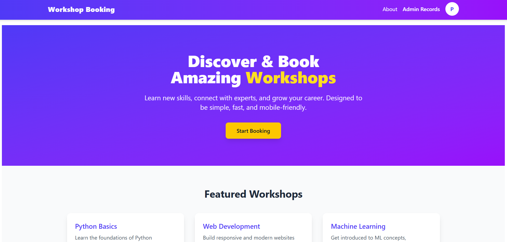
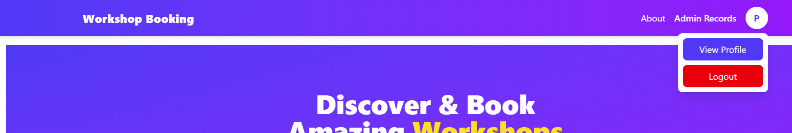
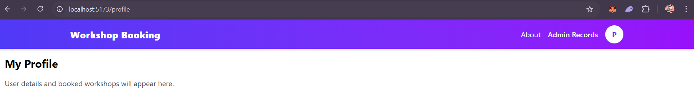
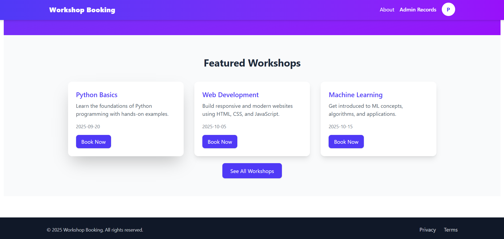
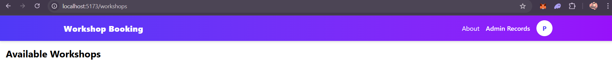
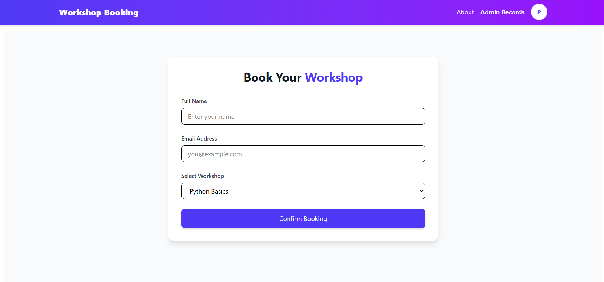
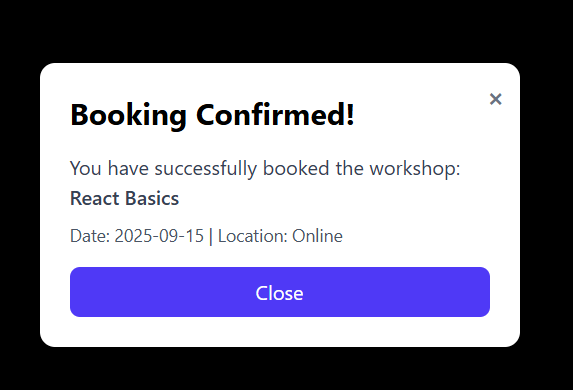
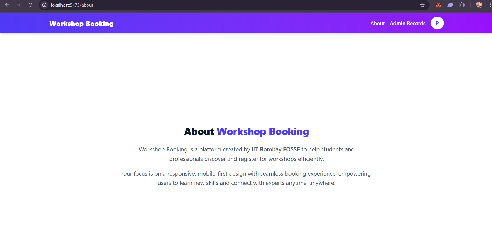
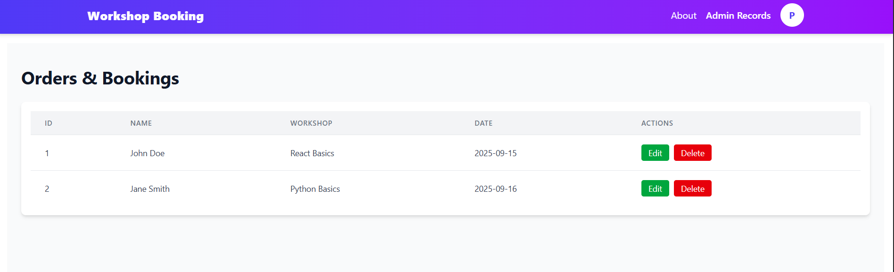
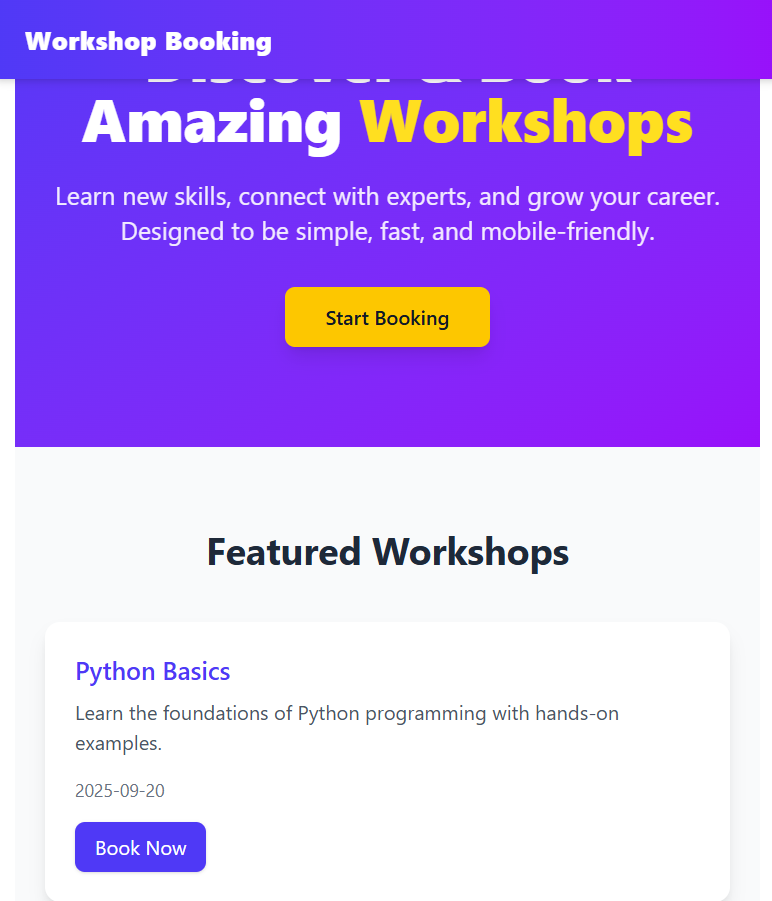

# Workshop Booking

> Website for coordinators to book workshops or propose dates based on their convenience
## Features

### Statistics
- **Instructors Only**
  - Monthly Workshop Count
  - Instructor/Coordinator Profile stats
  - Upcoming Workshops
  - View/Post comments on Coordinator's Profile
- **Open to All**
  - Workshops displayed on Map of India
  - Pie chart showing Total Workshops vs Type of Workshops

### Workshop Management
- Instructors can Accept, Reject, Delete, or Postpone workshops based on coordinators' requests

### Admin Panel
- View all enrolled users
- Edit or delete records

### Frontend
- Fully responsive and mobile-friendly
- Clean, production-ready folder structure
- Components broken down for maintainability
- Fast with loading states and optimized UI/UX
- Separate API calls from UI logic

### Booking
- Easily search and book workshops
- View current and upcoming workshops

## Tech Stack
- Frontend - React, TailwindCSS, Axios
- Backend - Django

## Demo Images

### Hero Section - Responsive, Enhanced UX - easily for user to navigate all features
  

### Navbar - easy for user/admin to access all the features
  

### User Profile - authentication, current workshops to attend
  

### Upcoming workshops
  

### All available workshops
  

### Booking your slot for the workshop
 

### Confirmation, venue, date for the workshop
  

### About the website
  

### Admin Panel - to edit, delete 
  

### Responsive - works for mobile and desktop views
